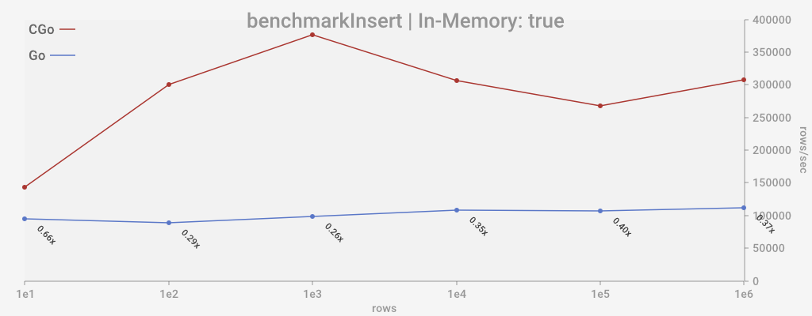
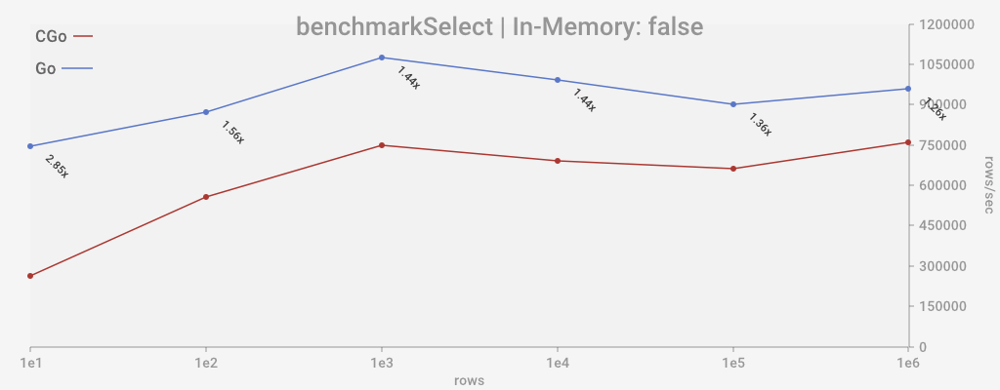

## Benchmarks
Generally, benchmarks are conducted against CGo implementation of SQLite (https://github.com/mattn/go-sqlite3).

## Doing benchmarks with go test command
```console
go test -bench . -run '^$'
```

## Doing benchmarks with alternative runner to plot results
```console
go test -v .
```
Dark color scheme:
```console
go test -v . -dark
```

### my results:

#### Insert
| On disk                                   | In memory                                |
| :---------------------------------------- | :--------------------------------------- |
|  |  |

#### Select
| On disk                                   | In memory                                |
| :---------------------------------------- | :--------------------------------------- |
|  |  |

## Adding benchmarks
A specific type of benchmark function is currently automated:
```go
type bechmarkOfNRows func(b *testing.B, db *sql.DB, nRows int)
```

You can implement benchmark functions of that type, then add them into ```allBenchmarksOfNRows``` variable (see [benchmarks.go](benchmarks.go))

```go
var allBenchmarksOfNRows = []bechmarkOfNRows{
	benchmarkInsert, 
	benchmarkSelect,
	}
```

Elements of ```allBenchmarksOfNRows``` will be automatically evaluated and plotted when alternative plotting runner is used (e.g. ```go run .```)

To make implemented benchmark available via go-test, you may write a simple stub like following (see [bench_test.go](bench_test.go)):
```go
func BenchmarkSelect(b *testing.B) {
	doBenchmarkOfNrows(b, benchmarkSelect)
}
```
